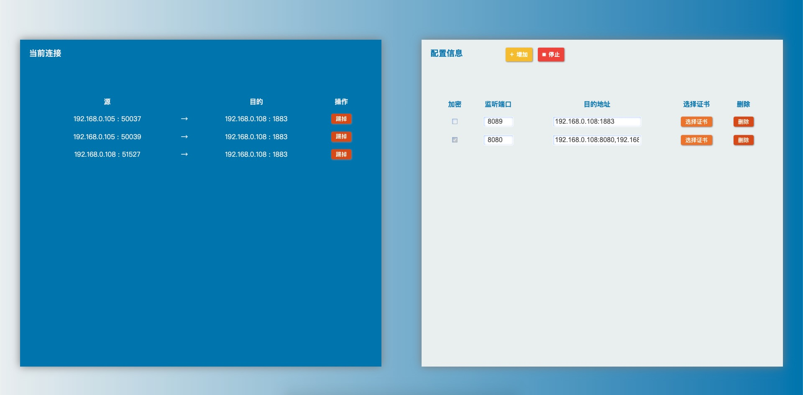

1. 理论上支持所有tcp协议的应用层协议，比如http，mqtt

2. 管理后台为h5，地址为 "ip:18081/index"，进入后如下图（不要在意h5的源码 😆 写得烂）
 
 
 
3. 可以增减监听端口，需要先停止监听服务（界面上"停止"按钮，未启动状态为"启动"）

4. 支持TLS，自己生成或者购买的都行，自己生成的需要自建CA，并系统信任

5. 若端口需要TLS，请启用"加密"复选框

6. 能在多平台上运行 linux macos windows，亦可以自己build docker

7. 非docker，需要目录 "certs" 和 "html"和下面的文件以及 "config.json"，保证TLS的加载和管理界面显示以及自己的代理配置加载

8. 单个端口可代理转发的目标地址可以多个，用","隔开

----
  
下载 "tcpProxy.tar.gz" 并解压， cd到该目录，"./TcpProxy_xxx(对应平台)"直接运行即可